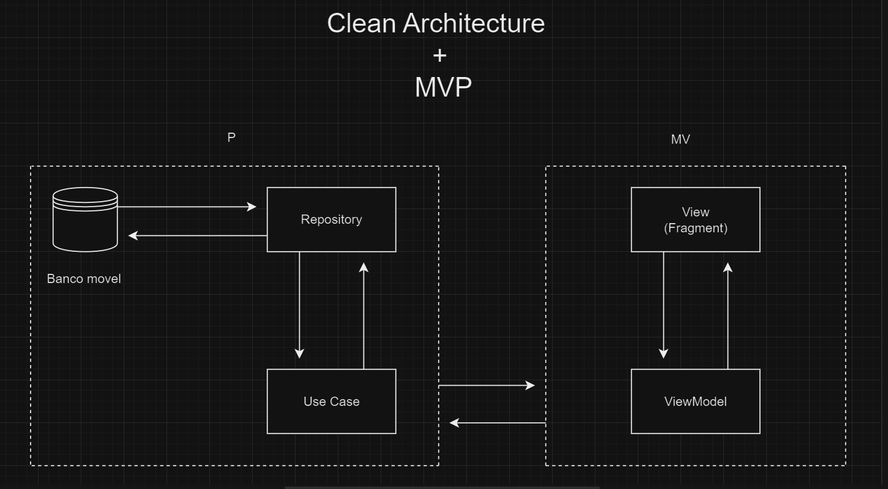

# Projeto Guarany

   

## Funcionalidades:

- Gerenciamento completo de clientes:
    - Cadastro, busca, atualização e exclusão de clientes.
    - Filtro por razão social, nome fantasia e CNPJ.
    - Suporte para pessoas físicas e jurídicas.
    - Endereços múltiplos para pessoas físicas.
    - Campos específicos para cada tipo de pessoa.
- Controle total de produtos:
    - Busca por status (normal, em estoque, lançamento e promoção).
    - Listagem com descrição, código, estoque, preço máximo e mínimo.
    - Detalhes do produto com histórico de preços.

## Tecnologias e Arquitetura:

- Desenvolvimento em Kotlin: Linguagem moderna e concisa para Android.
    - Banco de dados SQLite: Armazenamento de dados eficiente e leve.
    - Material Design: Interface intuitiva e moderna.
    - ViewPager e TabLayout: Navegação fluida entre diferentes seções.
    - Navigation Drawer: Menu lateral para acesso rápido às funcionalidades.
    - Modelo MVP: Arquitetura robusta e organizada.
    - Target SDK mais recente: Compatibilidade com as últimas APIs do Android.
    - Boas práticas de programação: Código limpo, modular e testável.

## Modelo de arquitetura:

)

## Consereções para avaliação:

### Desenvolvimento e Priorização de Funcionalidade:
1. Priorização de Funcionalidades:
   O desenvolvimento do aplicativo foi sensível ao tempo, o que significa que algumas funcionalidades idealizadas inicialmente não puderam ser concluídas dentro do prazo.
2. Requisitos Funcionais Pendentes:
   Alguns requisitos funcionais não foram finalizados devido à restrição de tempo.

3. Modo Escuro:
   O aplicativo foi desenvolvido para funcionar em modo claro, mas a ideia inicial era ter um modo escuro e um modo claro para compatibilidade com o tema do Android. No entanto, os requisitos funcionais foram priorizados nesta fase do projeto.

4. Simplificação das Entidades:
   As entidades do aplicativo foram simplificadas para facilitar e agilizar os testes de desenvolvimento, bem como a atualização e o cadastro de dados.

### Da conclusão dos requisitos funcionais:

- [x] ~~O aplicativo deve ser capaz de buscar/cadastrar/atualizar/deletar um cliente;~~
- [x] ~~O aplicativo deve ser capaz de buscar clientes pela razão social, nome fantasia e CNPJ;~~
- [ ] A listagem deve ter uma versão simples em Smartphone e uma versão com detalhes ao lado para Tablet;
- [ ] Um cliente pode ser pessoa jurídica ou İsica. Se for pessoa Física, deve ter CPF, nome (uƟlizar campo Razão Social), e-mail principal e-mail secundário, vários endereços (mínimo de 1). Se for pessoa Jurídica, deve trocar o CPF por CNPJ e adicionar o campo de nome fantasia.
- [ ]  O aplicaƟvo deve ser capaz de buscar todos os produtos separados pelo seu status: NORMAL / P. ESTOQUE / LANÇAMENTO / PROMOÇÃO
- [ ] O aplicaƟvo deve exibir na listagem de produtos: descrição. código, estoque, preço máximo e preço mínimo).
- [ ] Ao pressionar um produto, deve exibir um dialog com todos os preços dele em ordem crescente.

### Da conclusão dos requisitos não funcionais:

- [x] ~~O aplicaƟvo deve uƟlizar o banco SQLite. O modelo será passado com as tabelas;~~
- [x] ~~O aplicaƟvo deve ter como target SDK o SDk mais recente;~~
- [x] ~~O aplicaƟvo deve fazer uso das boas práƟcas de programação android;~~

### Da conclusão dos coponentes de tela:

- [x] ~~Uitlize ViewPager e TabLayout~~
- [x] ~~Utilize o Material Design~~
- [x] ~~Uitlize NavigaƟon Drawer~~
- [x] ~~Utilize o Modelo MVP.~~

## License

[MIT](https://choosealicense.com/licenses/mit/)

